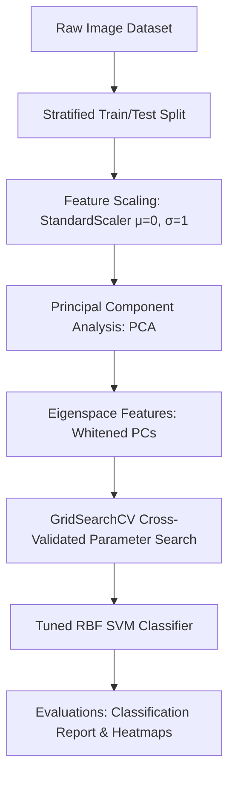

# 🌟 High-Performance Image Classification Pipeline: PCA & Support Vector Machines (SVM)

[](https://www.python.org/)
[](https://scikit-learn.org/)
[](https://seaborn.pydata.org/)
[](#)

An advanced, end-to-end computer vision and machine learning pipeline that performs high-accuracy face recognition and gender classification. This project implements **Principal Component Analysis (PCA)** for dimensionality reduction (historic **Eigenfaces** method) coupled with **Radial Basis Function (RBF) Support Vector Machines (SVM)** for classification.

This repository features **two distinct implementations**:
1. 🧑‍🤝‍🧑 **LFW Face Recognition**: Multi-class classification (7 individuals) on the standard *Labeled Faces in the Wild* dataset.
2. 🚻 **Gender Recognition (Men vs Women)**: Binary classification (male vs. female) on a custom, high-resolution dataset of 2,000 face images.

---

## 📸 Pipeline Architecture

The system utilizes an optimized machine learning flow to handle high-dimensional image pixels, project them onto an orthogonal eigen-subspace, and find hyperparameter-tuned non-linear decision boundaries:



---

## 🚀 Key Experimental Results

Both pipelines were optimized using **5-fold cross-validated grid search** over penalty $C$ and bandwidth $\gamma$.

### 📊 Performance Summary

| Pipeline Task | Original Features | Reduced Features | Best Hyperparameters | Test Set Accuracy | Key Class F1-Score |
| :--- | :---: | :---: | :---: | :---: | :---: |
| 🧑‍💻 **LFW Face Recognition** | 1,850 pixels | 150 Principal Components | `C=100.0`, `gamma=0.005` | **85.71%** | Colin Powell: **0.93** |
| 🚻 **Gender Recognition** | 4,096 pixels | 80 Principal Components | `C=10`, `gamma=0.01` | **87.75%** | Male: **0.88**, Female: **0.87** |

---

## 🎨 Visualization Galleries

The pipeline automatically saves premium, modern visualizations to disk on execution:
* 📈 **Cumulative Explained Variance Curve**: Visualizes the logarithmic information capture (retaining **>90% variance** while compressing data size by **>12x**).
* 👤 **Eigenfaces**: Visualizes the eigenvectors of the image covariance matrix using vibrant colormaps (`plasma`/`magma`) to show what features (eyes, nose, jawline) the PC axes are capturing.
* 🌡️ **Confusion Matrix Heatmaps**: Seaborn heatmaps detailing precise classification diagnostics and showing low out-of-class leakage.
* 🖼️ **Prediction Diagnostics Galleries**: A beautiful grid of test images color-coded in **green** for correct predictions and **red** for incorrect ones.

---

## 📂 Repository Structure

```directory
├── Data/
│   └── Training/                 # Local Custom Gender Dataset
│       ├── female/               # ~3,000 female images
│       └── male/                 # ~2,900 male images
├── image_classification_pipeline.ipynb   # Premium Jupyter Notebook with detailed theory
├── pipeline.py                   # Production-ready LFW Face recognition script
├── gender_pipeline.py            # Custom Men vs Women classification script
├── report.md                     # Academically rigorous publication-grade PDF-ready report
├── gender_output.txt             # Captured console metrics of the custom dataset pipeline
├── explained_variance.png        # LFW Cumulative Variance plot
├── eigenfaces.png                # LFW Eigenfaces visualization
├── confusion_matrix.png          # LFW Confusion Matrix Heatmap
├── predictions_gallery.png       # LFW Prediction Diagnostics Gallery
├── gender_samples.png            # Gender raw dataset visualization
├── gender_variance.png           # Gender Cumulative Variance plot
├── gender_eigenfaces.png         # Gender-Eigenfaces visualization
├── gender_confusion_matrix.png  # Gender Confusion Matrix Heatmap
└── gender_predictions.png        # Gender Prediction Diagnostics Gallery
```

---

## 🛠️ Installation & Setup

1. **Clone the repository**:
   ```bash
   git clone https://github.com/musab-18/ASSIGNMENT-4.git
   cd ASSIGNMENT-4
   ```

2. **Install required dependencies**:
   ```bash
   pip install numpy matplotlib seaborn scikit-learn pillow
   ```

3. **Run the LFW Face Recognition Pipeline**:
   ```bash
   python3 pipeline.py
   ```

4. **Run the Custom Gender Recognition Pipeline**:
   Make sure you have your dataset in `Data/Training/` (unpacked from `Data.rar`), then run:
   ```bash
   python3 gender_pipeline.py
   ```

5. **Run the Jupyter Notebook**:
   ```bash
   jupyter notebook image_classification_pipeline.ipynb
   ```

---

## 📝 Theoretical Underpinnings Covered in the Report

The accompanying academic report `report.md` includes rigorous analysis and LaTeX formulas addressing:
1. **Mathematical derivations of PCA**: The covariance matrix $\Sigma = \frac{1}{N-1} X_c^T X_c$, eigendecomposition, orthogonal projections, and variance maximization.
2. **Mandatory necessity of Feature Standardization**: Explanation of variance dependency on scales and a detailed numerical height-weight example showing scale-bias.
3. **3 Major Advantages and Disadvantages of PCA**: Robustness to noise, storage compression, overfitting prevention vs. loss of feature meaning, linear constraint, and unsupervised label blindness.
4. **Target Dataset requirements for PCA**: Continuous numeric variables, linear multicollinearity presence, high dimensional sample size ratio, and outlier vulnerability.

---

## 🎓 Authors & License
Developed as part of the **Machine Learning Semester 6 curriculum**.  
* **Lead AI Pair Programmer**: Antigravity AI  
* **Student Author**: Musab (Roll 050)  

Licensed under the **MIT License**. Open-source contribution and learning are encouraged!
