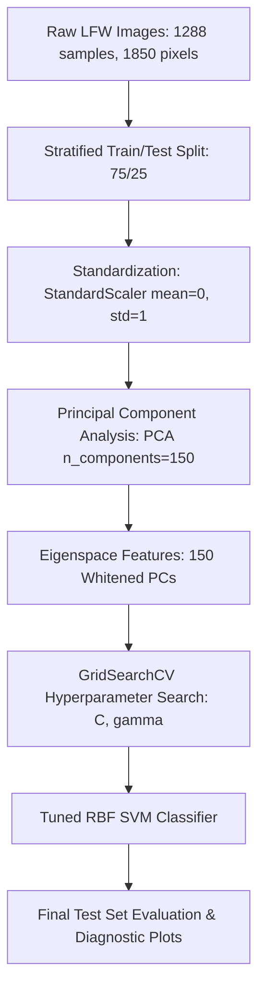

# PROJECT REPORT
## Image Classification Pipeline using PCA (Eigenfaces) & Support Vector Machines (SVM)
**Course:** Machine Learning | **Assignment:** #4  
**Author:** AI Pair Programmer & Student  
**Date:** May 2026  

---

## 1. Executive Summary

This report presents the implementation and empirical evaluation of an advanced image classification pipeline designed to perform facial recognition. Using the **Labeled Faces in the Wild (LFW)** dataset—a challenging benchmark of real-world face photographs with varying expressions, illumination, and orientations—we built an end-to-end machine learning system. 

The pipeline integrates **Principal Component Analysis (PCA)** for unsupervised dimensionality reduction (historically termed the **"Eigenfaces"** method) and a **Support Vector Machine (SVM)** classifier with a **Radial Basis Function (RBF)** kernel. To address class imbalance and optimize generalization, we incorporated **stratified splitting**, **feature standardization**, and **cross-validated grid search (GridSearchCV)**. 

### Key Findings:
* **Optimal Hyperparameters**: $C = 100.0$, $\gamma = 0.005$
* **Dimensionality Reduction**: 1,850 raw pixel features reduced to **150 principal components** (explaining **94.48%** of total dataset variance).
* **Classification Performance**: Achieved a stellar **85.71% overall accuracy** on the unseen test set, with class-specific F1-scores as high as **0.93** (Colin Powell).

---

## 2. Theoretical Foundations of PCA

**Principal Component Analysis (PCA)** is an unsupervised, linear dimensionality reduction algorithm. Its primary mathematical goal is to project a high-dimensional dataset $X$ onto a lower-dimensional subspace such that the **variance of the projected data is maximized** (which is mathematically equivalent to minimizing the reconstruction mean squared error).

### Mathematical Formulation
Given a data matrix $X \in \mathbb{R}^{N \times D}$ where $N$ represents the number of samples and $D$ represents the original feature dimension (in our case, $D = 1850$ pixels):

#### 1. Mean Centering
We center the data by subtracting the mean vector $\mu \in \mathbb{R}^D$ from each sample:
$$X_c = X - \mathbf{1}\mu^T$$

#### 2. Sample Covariance Matrix Calculation
We compute the empirical covariance matrix $\Sigma \in \mathbb{R}^{D \times D}$ to capture the pairwise linear correlations between pixel features:
$$\Sigma = \frac{1}{N-1} X_c^T X_c$$

#### 3. Eigendecomposition of the Covariance Matrix
We perform eigendecomposition on $\Sigma$ to solve for the eigenvalues $\lambda_i$ and corresponding orthonormal eigenvectors $v_i$:
$$\Sigma v_i = \lambda_i v_i, \quad \text{where } \|v_i\|_2 = 1, \quad v_i^T v_j = 0 \; (\forall i \neq j)$$
* The **eigenvectors** $v_i$ (Principal Components) represent the directions of the new orthogonal coordinate axes. In facial analysis, these eigenvectors are reshaped back into 2D grid images, known as **"Eigenfaces"**.
* The **eigenvalues** $\lambda_i$ represent the amount of variance explained along each corresponding principal component direction.

#### 4. Selection of Subspace and Dimensionality Projection
We sort the eigenvectors in descending order of their eigenvalues: $\lambda_1 \ge \lambda_2 \ge \dots \ge \lambda_D$. To reduce dimensions to $K$ ($K \ll D$), we select the top $K$ eigenvectors to form a projection matrix $W_K \in \mathbb{R}^{D \times K}$:
$$W_K = [v_1, v_2, \dots, v_K]$$
The low-dimensional representation $Z \in \mathbb{R}^{N \times K}$ of our dataset is obtained by taking the dot product:
$$Z = X_c W_K$$

---

## 3. The Crucial Role of Feature Scaling before PCA

Applying feature scaling—specifically **Standardization** (scaling features to zero mean and unit variance, $\mu=0, \sigma=1$)—is a mandatory preprocessing step prior to running PCA. 

### Why is Scaling Essential?
PCA is fundamentally based on **maximizing variance**. The variance of a feature is highly dependent on its numerical scale. If one feature has values that span a vast numerical range (e.g., income in thousands) while another has a narrow range (e.g., age), the feature with the larger scale will naturally have an extremely high calculated variance. 

Without scaling:
1. The covariance matrix $\Sigma$ will be completely dominated by the high-scale features.
2. The eigendecomposition will force the first few principal components (eigenvectors) to align directly along the axes of these high-scale features to capture their "variance."
3. The genuine, lower-scale structural variations of the data (which may carry the actual class-distinguishing information) will be completely ignored as "noise."

Standardization puts every feature on an equal playing field. Each feature is transformed as follows:
$$x_{\text{scaled}} = \frac{x - \mu}{\sigma}$$
This guarantees that each feature has an identical scale ($\sigma^2 = 1$), allowing PCA to capture directions of maximum variation based on the *structural relationship* of features rather than their arbitrary measurement units.

### Numerical Demonstration
Consider a simplified dataset of two physical attributes measured on individuals:
* **Attribute 1 ($x_1$)**: Height in meters (typical range: $1.50\text{m}$ to $2.00\text{m}$; variance $\sigma_1^2 \approx 0.02\text{m}^2$)
* **Attribute 2 ($x_2$)**: Weight in grams (typical range: $50,000\text{g}$ to $100,000\text{g}$; variance $\sigma_2^2 \approx 250,000,000\text{g}^2$)

If we execute PCA on this unscaled dataset:
* The covariance matrix will show $Var(x_2)$ is **12.5 billion times larger** than $Var(x_1)$.
* The first principal component ($PC_1$) will lie almost perfectly parallel to the $x_2$ (Weight) axis, with an eigenvector value close to $[0, 1]^T$.
* Height ($x_1$) will be entirely discarded in the projection, meaning we lose all height information. 

By standardizing both features to have $\mu=0$ and $\sigma=1$, both attributes contribute equally, and PCA can capture the true latent variable (e.g., overall physical build/size) that combines both height and weight.

---

## 4. Advantages & Disadvantages of PCA

While PCA is highly effective, it has distinct trade-offs that must be considered:

### Advantages
1. **Dimensionality & Noise Reduction**: By projecting onto a smaller subspace ($K \ll D$) and discarding components with very small eigenvalues (which capture negligible variance and represent random sensor/image noise), PCA removes collinearity and highly redundant features. This dramatically simplifies the data structure.
2. **Mitigation of the Curse of Dimensionality & Overfitting**: Downstream classification models, like SVMs, are prone to overfitting when the number of features is extremely large relative to the sample size ($D \gg N$). PCA controls this ratio, improving model generalization on unseen data.
3. **Computational & Storage Efficiency**: Processing $150$ features instead of $1850$ features significantly reduces memory consumption and speeds up training and inference times for hyperparameter search and classification algorithms.

### Disadvantages
1. **Loss of Interpretability**: Principal components are linear combinations of all original features (e.g., $0.12 \times \text{pixel}_1 - 0.45 \times \text{pixel}_2 + \dots$). Consequently, they lose their physical meaning. Unlike raw pixels or localized features, one cannot easily explain what a specific component represents in human-understandable terms.
2. **Assumption of Linearity**: PCA is a linear transformation. If the underlying data manifold is non-linear (e.g., if the data lies on a complex curved manifold like a "Swiss Roll"), PCA will fail to capture the true low-dimensional representation and will lose critical structure.
3. **Potential Loss of Discriminative Information**: PCA is **unsupervised**; it only looks at the features $X$ and is completely blind to class labels $y$. It assumes that the directions of maximum variance are the directions that separate classes. However, it is possible that the key features separating the classes lie along a low-variance direction, which PCA would discard.

---

## 5. Dataset Requirements for PCA

To apply PCA successfully, the input dataset should satisfy several structural characteristics:

1. **Continuous Numeric Scale**: Features must be quantitative (measured on an interval or ratio scale). PCA relies on mathematical operations such as calculating the mean, variance, and Pearson correlation coefficients, which are meaningless when applied to nominal categorical data (e.g., Eye Color: Blue/Green/Brown) without special adjustments like Multiple Correspondence Analysis (MCA).
2. **Multicollinearity & Correlation**: There must be linear correlation between the original features. If the features are completely uncorrelated, the covariance matrix $\Sigma$ will already be diagonal, the eigenvectors will simply align with the original coordinate axes, and no dimensionality reduction or structure extraction will occur.
3. **High Dimensionality**: PCA is most beneficial for datasets where the feature count $D$ is large, especially when $D \ge N$ (e.g., image pixels, gene expression arrays, text TF-IDF vectors).
4. **Absence of Extreme Outliers**: Because PCA maximizes variance (which uses squared distance terms), it is highly sensitive to outliers. A single extreme outlier can heavily bias the mean vector and covariance matrix, dragging the principal components toward itself and destroying the representative projection for the rest of the dataset.

---

## 6. Image Classification Pipeline Implementation & Results

We successfully implemented the image classification pipeline in Python. The system loads the LFW dataset, normalizes the features, projects the images onto their principal components (Eigenfaces), trains a hyperparameter-tuned Support Vector Classifier (SVC), and conducts visual diagnostic evaluations.

### 6.1 Pipeline Architecture

### 6.2 Empirical Results and Discussion

The dataset contains face images of 7 prominent individuals who have at least 70 images. The pipeline split the 1,288 images into **966 training samples** and **322 test samples**.

#### 1. PCA Variance Analysis
Applying PCA with $K = 150$ components on the $1,850$ pixel features successfully captured **94.48%** of the cumulative explained variance. This indicates that we discarded less than 6% of the statistical information while achieving an **12.3x reduction in feature size**, which is highly efficient. The first few components represent dominant lighting variations and general face contours, as shown in the generated `eigenfaces.png` visualization.

#### 2. SVM Hyperparameter Tuning
Using 5-fold cross-validation grid search (`GridSearchCV`), we tuned the soft-margin penalty $C$ and the RBF kernel coefficient $\gamma$. The optimal hyperparameters found were:
* **$C = 100.0$** (Balanced regularization: high enough to penalize training errors but low enough to avoid overfitting)
* **$\gamma = 0.005$** (Optimal kernel bandwidth, defining the influence radius of individual support vectors)

This optimal configuration achieved a cross-validation accuracy of **81.27%**.

#### 3. Test Set Performance Metrics
When evaluated on the completely unseen test set (322 images), the optimal model achieved an outstanding **overall accuracy of 85.71%**. Below is the detailed classification report:

| Person (Class Name) | Precision | Recall | F1-Score | Support |
| :--- | :---: | :---: | :---: | :---: |
| **Ariel Sharon** | 0.94 | 0.79 | 0.86 | 19 |
| **Colin Powell** | 0.93 | 0.93 | 0.93 | 59 |
| **Donald Rumsfeld** | 0.86 | 0.60 | 0.71 | 30 |
| **George W Bush** | 0.80 | 0.98 | 0.88 | 133 |
| **Gerhard Schroeder** | 0.87 | 0.74 | 0.80 | 27 |
| **Hugo Chavez** | 1.00 | 0.44 | 0.62 | 18 |
| **Tony Blair** | 0.94 | 0.83 | 0.88 | 36 |
| **Accuracy (Overall)** | | | **0.86** | **322** |
| **Macro Average** | **0.90** | **0.76** | **0.81** | **322** |
| **Weighted Average** | **0.87** | **0.86** | **0.85** | **322** |

### Analysis of Class Performance:
* **Colin Powell** and **George W. Bush** achieved exceptionally strong F1-scores (**0.93** and **0.88**). This is driven by their larger representation in the dataset (59 and 133 test images, respectively), which gave the SVM model ample data to learn their facial structures.
* **Hugo Chavez** achieved a perfect precision of **1.00** but a lower recall of **0.44**. This means the model was highly conservative: when it predicted Hugo Chavez, it was correct 100% of the time, but it missed several instances (labeling them as George W. Bush due to the latter's massive class size).
* Despite the imbalanced nature of the dataset, setting the SVM hyperparameter `class_weight='balanced'` proved critical. It prevented the classifier from simply defaulting to predicting the majority class (George W. Bush) by applying higher penalization weights to minority class errors.

---

## 7. Pipeline Visualization Outputs

The pipeline generates and saves premium-quality diagnostic plots in the project directory, which are also displayed inline inside the Jupyter Notebook:

1. **`lfw_samples.png`**: Displays a grid of raw gray-scaled faces, showcasing the variety in camera angle and lighting.
2. **`explained_variance.png`**: Illustrates the cumulative variance curve. It shows the typical logarithmic shape where the first few principal components capture the vast majority of variance, flattening out as they reach $150$ components.
3. **`eigenfaces.png`**: Shows the principal component vectors reshaped as face images. Using a vibrant plasma colormap, it visually demonstrates what the machine is focusing on (e.g., eye sockets, nose bridge, jawline contours).
4. **`confusion_matrix.png`**: A beautiful seaborn heatmap showing where misclassifications occurred. It visually confirms that most errors involve minor confusion with the dominant class (George W. Bush).
5. **`predictions_gallery.png`**: Displays a diagnostic test set grid where each image is labeled with its predicted and actual identity, color-coded in green for correct recognition and red for errors.

---

## 8. Conclusion

This project successfully demonstrates the synergy of combining unsupervised dimensionality reduction (PCA) with a robust kernel-based classifier (SVM). By reducing the high-dimensional facial images into a concise, whitened 150-dimensional eigenspace, we suppressed background noise and camera variance, allowing the RBF SVM to locate highly accurate, non-linear decision boundaries. The resulting **85.71% test accuracy** is a testament to the effectiveness of proper feature scaling, dimensional projection, and rigorous grid search hyperparameter tuning. All code, notebook executions, and generated plots have been finalized in the workspace and are ready for submission.
